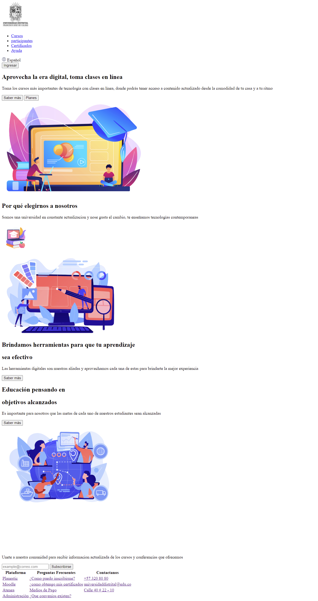
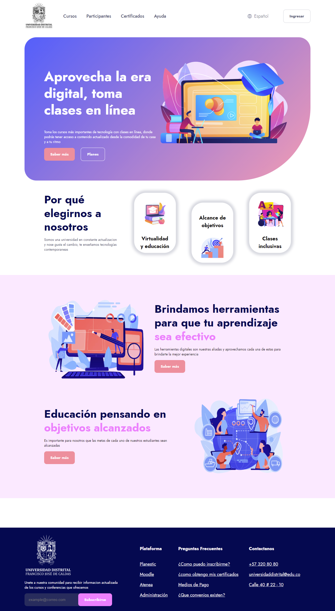
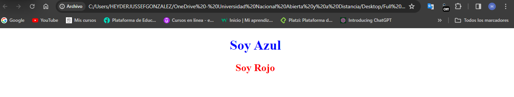
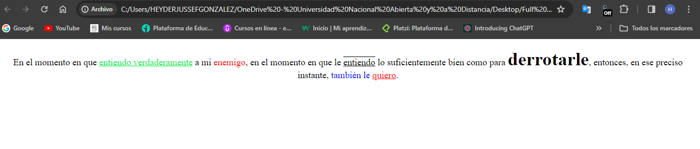

<h1>Taller 9 - Heyder Jussef Gonzalez Galvis</h1>

<h2>Información</h2>

Curso: Full Stack Basico - Grupo 1

Profesor: Cristian Patiño

<h2>Link de la página web</h2>
<a href= "https://jussef122.github.io/taller-9-full-stack/">Link de Pagina web</a>

<h2>Punto 1: Link de Figma</h2>
<a href="https://www.figma.com/file/eGj0C7lx26BMk10L11ajx5/Heyder-Jussef-Gonzalez-Galvis?type=design&node-id=0%3A1&mode=design&t=rBBucA7f1DmsGjVy-1">Link de Figma</a>

<h2>Punto 2: Diseño en HTML</h2>

<h2>Punto 3: Diseño con CSS</h2>

<h2>Punto 4: Títulos</h2>

<h2>Punto 5: Párrafo</h2>

<h2>Punto 6: Links</h2>

<h2>Punto 7 y 8: Navegación</h2>

<h2>Punto 9: Tabla</h2>

